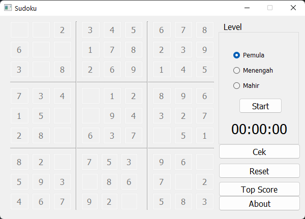

## Requirements
- [Python](https://www.python.org/downloads/)
- PyQt5 `pip install PyQt5`
- numpy `pip install numpy`

## How to run (Recommended)
1. double click `runme.bat` (Windows Only)

## How to run (Manual)
1. `python -m venv venv` (or `python3`)
2. `pip install -r requirements.txt`
3. `venv\Scripts\activate` (Windows) or `venv/bin/activare` (Linux)
4. `python main.py`

## Game UI
